---

copyright:
  years: 2017, 2018
lastupdated: "2018-03-16"

---

{:new_window: target="_blank"}
{:shortdesc: .shortdesc}
{:codeblock: .codeblock}
{:screen: .screen}
{:pre: .pre}

# Operate Starter Plan network
{: #operate-starter-plan-network}

{{site.data.keyword.blockchainfull_notm}} Platform brings a Network Monitor to provide an overview of your blockchain environment, including network resources, members, joined channels, transaction performance data, and deployed chaincodes. The Network Monitor also offers you the entry point to run Swagger APIs, develop a network with {{site.data.keyword.blockchainfull_notm}} Platform: Develop, and try sample applications.
{:shortdesc}

The Network Monitor exposes the following screens in three sections. You can navigate to each screen from the left navigator in the Network Monitor.
- The **My network** section contains the "[Overview](#overview)", "[Members](#members)", "[Channels](#channels)", "[Notifications](#notifications)", and "[APIs](#apis)" screens.
- The **My code** section contains the "[Write code](#write_code)", "[Install code](#chaincode)", and "[Try samples](#samples)" screens.
- The "[Get help](#support)" screen.

You can [switch between the organizations](#switch_organizations) that you own and [reset your network](#reset_network) from the drop-down panel on the top right of the Network Monitor.

This tutorial describes each of the above screens and functions.

## Overview
{: #overview}

The "Overview" screen displays real-time status information about your blockchain resources, including the orderer, CA, and peer. Each resoure is displayed under four distinct headers: **Type**, **Name**, **Status**, and **Actions**. When your network starts, one orderer, one CA, and one peer are running. The CA is specific to the organization, whereas the orderer is a common endpoint that is shared across the network.

**Figure 1** shows the "Overview" screen:

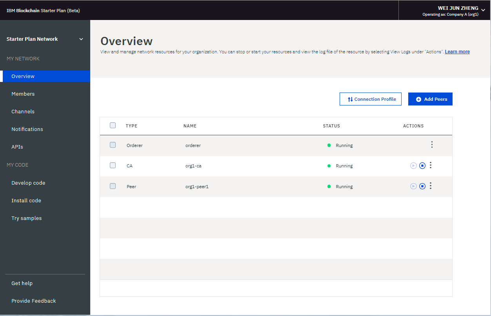
*Figure 1. Network overview*

### Node actions
  The **Actions** header of the table provides buttons to start or stop your components. You can also start or stop a group of nodes by selecting multiple nodes and then clicking the **Start Selected** or **Stop Selected** button. The **Start Selected** or **Stop Selected** button appears on top of the table when you select one or more nodes.

  You can also check component logs by clicking **View Logs** from the dropdown list under the **Actions** header. The logs expose the calls between the various network resources and are useful for debugging and troubleshooting. For example, experiment by stopping a peer and attempting to target it with a transaction, and you will see connectivity errors. When you restart the peer and attempt the transaction again, you will see a successful connection. You can also leave a peer down for an extended period of time as your channels continue to transact. When the peer is brought back up, you will notice a synchronization of the ledger as it receives the blocks that were committed when it was down. When the ledger has been fully synchronized you'll be able to perform normal invokes and queries against it.

### Connection Profile
  You can view the JSON file about low level network information of each resource by clicking the **Connection Profile** button. The connection profile contains all the configuration information that you need for an application. However, because this file only contains the addresses for your specific components and the orderer, if you need to target additional peers, you need to obtain their endpoints. The header containing "url" displays the API endpoint of each component. These endpoints are required in order to target specific network components from a client-side application and their definitions will typically live in a JSON-modeled configuration file that accompanies the app. If you are customizing an application that requires endorsement from peers that are not part of your organization, you'll need to retrieve the IP addresses of those peers from the relevant operators in an out-of-band operation. Clients must be able to connect to any peers from which they need a response.

### Add peers
{: #peers}
  Network members need to have peers to store their copies of network ledger and to run chaincode to query or update the ledger. If the endorsement policy defines a peer as an endorsing peer, the peer also returns endorsement results to applications.

  Starter Plan creates one peer for each of the two organizations by default. You can add more peers for your organizations based on your own requirements. You might be in different scenarios when you need more peers. For example, you might want multiple peers to join the same channel for redundancy. Each peers processes the channel's transactions and writes to their respective copies of the ledger. If one of the peers fail, the other peer (or multiple other peers) can continue processing transactions and application requests. You also have the option to symmetrically load balance all application requests across the peers, or you could target different peers for different functions. For example, you can use one peer to query the ledger and use another peer to process endorsements for ledger updates.

  Click the **Add Peers** button at the top right to add peer nodes to your network. In the pop-up "Add Peers" panel, select the number and size of peer nodes you want to add.

## Members
{: #members}

The "Members" screen contains two tabs to display network member information in the "Members" tab and certificate information in the "Certificates" tab.

### Members
{: #members_tab}
**Figure 2** shows the initial "Members" screen displaying your network members in the "Members" tab:

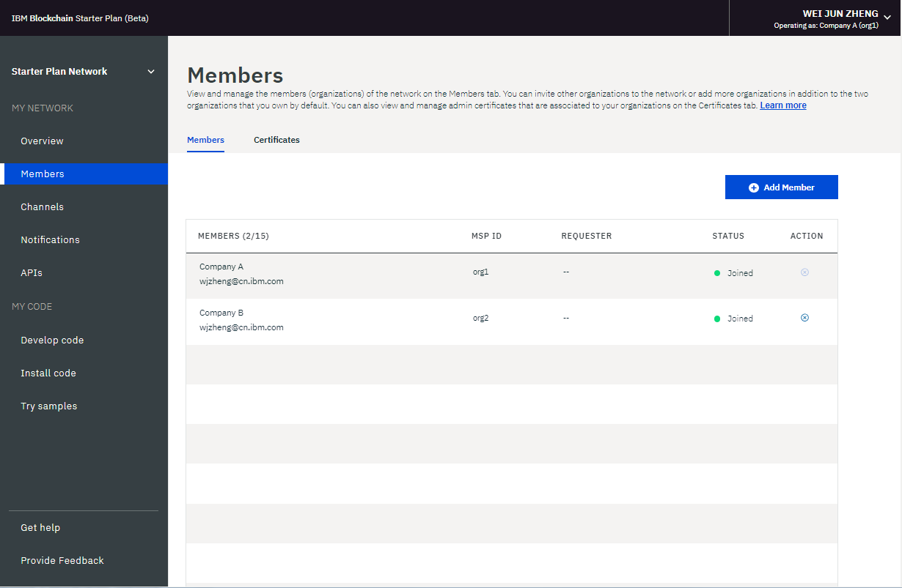
*Figure 2. Network members*

Click **Invite Members** to invite more members to your network. In Starter Plan, you have two options:
- **Invite a member**. You can invite other organizations to become members of your network. The invited organizations can then join and collaborate with you in the network.
- **Add a member**. You can also add another member using your own email address. You would have control of it just as you have of the two organizations that you receive with Starter Plan by default.

**Figure 3** shows the "Invite Member" window.

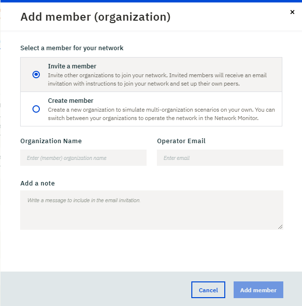
*Figure 3. Invite Member*

### Certificates
**Figure 4** shows the initial "Members" screen displaying member certificates in the "Certificates" tab:

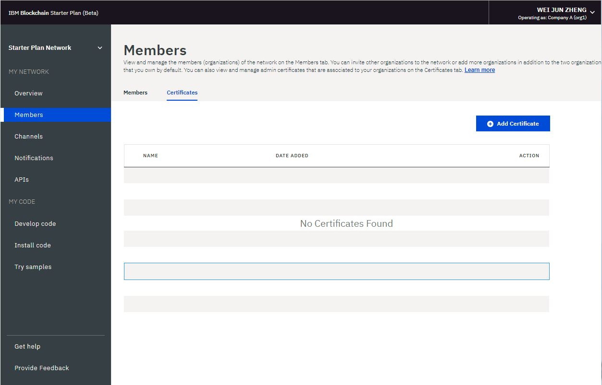
*Figure 4. Certificates*

Operators can manage the certificates for the members in the same institution in the "Certificates" tab. Click **Add Certificate** to open the "Add Certificate" panel. Give a name to your certificate, paste your client-side certificates in PEM format to the "Key" field, and click **Submit**. You need to restart your peers before the client-side certificates can take effect.

For information about generating your certificate key, see [Generating the client-side certificates](v10_application.html#generating-the-client-side-certificates).

## Channels
{: #channels}

Consisting of a subset of network members who wish to transact privately, channels provide data isolation and confidentiality by allowing the members of a channel to establish specific rules and a separate ledger which only channel members can access. Every network must have at least one channel for transactions to take place. Each channel has a unique ledger and users must be properly authenticated to perform read/write operations against this ledger. If you're not on a channel, you can't see any data.

**Figure 5** shows the initial dashboard screen displaying an overview of all channels in your network:

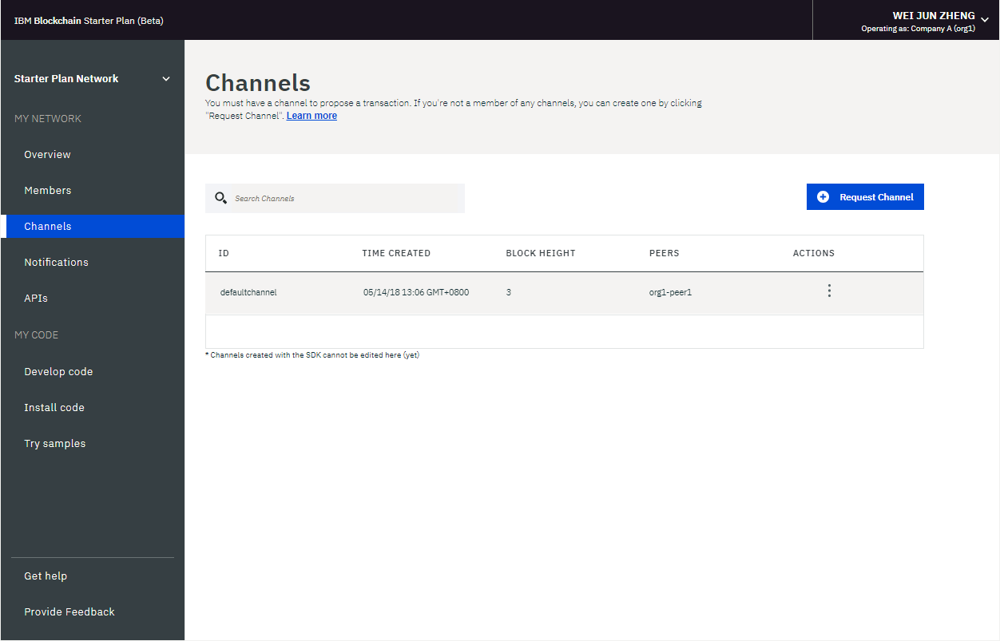
*Figure 5. Channels*

Creating a channel will result in the generation of a channel-specific ledger. For more information, see [Creating a channel](howto/create_channel.html).

You can also select an existing channel to view more precise details about the channel, membership, and active chaincodes. For more information, see [Monitoring a network](howto/monitor_network.html).

## Notifications
{: #notifications}

You can handle pending requests and view completed requests in the "Notifications" screen.

**Figure 6** shows the "Notifications" screen:

*Figure 6. Notifications*

When you create a channel or are invited to a new channel, a notification will appear in the Network Monitor.

The requests are grouped into "All", "Pending", and "Completed" sub-tabs. Numbers after the header indicate the number of requests in each sub-tab.
   * You can find all your requests in the "All" sub-tab.
   * Requests that you have not accepted or declined, or you have not viewed, are in the "Pending" sub-tab. Click the **Review Request** button to view the request, which includes the channel policy and members, and voting status. If you are a channel operator, you can either **Accept** or **Decline** the request, or handle it at another time by clicking **Later**. If the request is accepted by enough channel operators, you can click **Submit Request** to activate the channel update.
   * A submitted request will appear in the "Completed" sub-tab.  You can click **Review Request** to view its details.

If you have a long list of requests, you can search for a request in the search field on the top.

Pending requests can be deleted by selecting the boxes in the front of them and clicking **Delete Request**.

## APIs
{: #apis}

To facilitate application development, we have exposed our APIs, which you can test against your network using a Swagger UI.

**Figure 7** shows the "APIs" screen:

*Figure 7. APIs*

Click the **Swagger UI** link to open the Swagger UI. Note that you need to authorize the Swagger UI with your network credentials (which can be found on this APIs page) before you can run the APIs. For more information, see [Using Swagger APIs](howto/swagger_apis.html).

## Write code
{: #write-code}

Starter Plan integrates {{site.data.keyword.blockchainfull_notm}} Platform: Develop and provides a development environment with industry standard tools and technologies. You can develop your a network in the environment online or locally. After you develop a network, you can deploy it back to your Starter Plan network.

**Figure 8** shows the "Write code" screen:

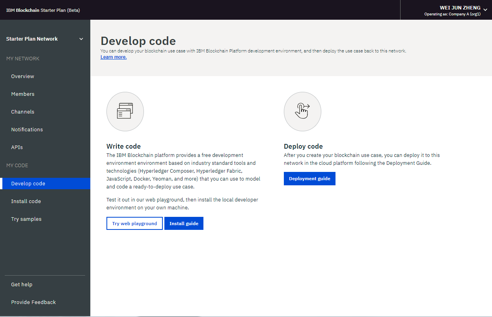
*Figure 8. Write code*

For more information about developing and deploying your code with Starter Plan, see [Developing business networks with Starter Plan](develop_starter.html).

## Install code
{: #chaincode}

Chaincodes, which are also known as "smart contracts", are pieces of software containing a set of functions to query and update the ledger. They are installed on peers and instantiated on a channel.

**Figure 9** shows the "Install code" screen:

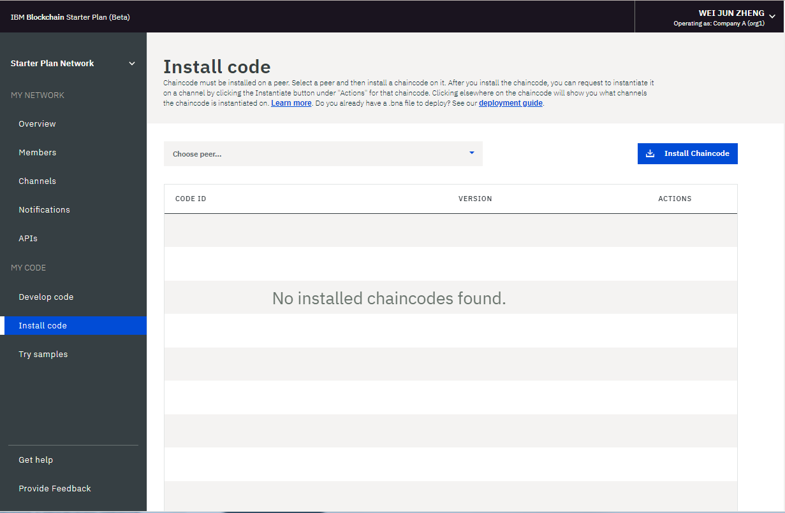
*Figure 9. Chaincode*

A chaincode is first installed on a peer's filesystem and then instantiated on a channel. For more information, see [Installing and instantiating a chaincode](howto/install_instantiate_chaincode.html).

## Try samples
{: #samples}

Sample applications help you to get a better understanding of a blockchain network and application development. Starter Plan enables you to deploy and launch sample applications in the Network Monitor.

**Figure 10** shows the "Samples" screen:

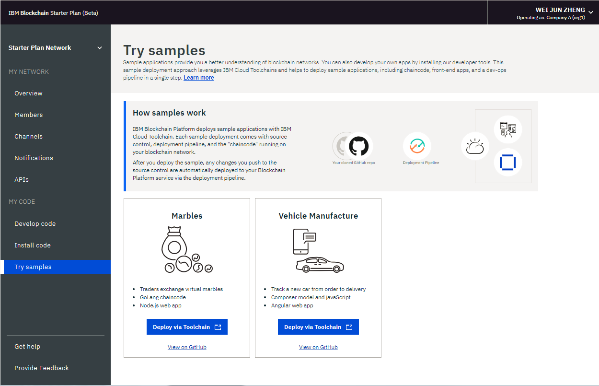
*Figure 10. Samples*

The sample deployment leverages the [DevOps Toolchain service ](https://console.bluemix.net/devops/toolchains) to automate your process of source control, delivery pipeline, and enable chaincode. Choose a sample application, and click the **Deploy via Toolchain**. For more information, see [Deploying sample applications](howto/prebuilt_samples.html).

## Get help
{: #support}

The "Get help" screen contains two tabs to provide support information in the "Support" tab and to describe new and changed functions of each release in the "Release Notes" tab.

**Figure 11** shows the initial "Support" screen displaying support information in the "Support" tab:

*Figure 11. Blockchain support*

Use the links and resources on this page to access troubleshooting and support forums.

* [{{site.data.keyword.blockchainfull_notm}} Service docs](index.html) under **Getting started**, which is this doc site, provides guidances on how to start with {{site.data.keyword.blockchainfull}} Platform on {{site.data.keyword.Bluemix_notm}}. You can find corresponding topics from the left navigator or search any term with the search function on the top.
* [IBM Developer Works ](https://developer.ibm.com/blockchain/) under **Community help** contains resources and information for developers.
* [IBM dWAnswers ](https://developer.ibm.com/answers/smartspace/blockchain/) under **Support ticket** serves as a platform for questions and responses. You can search for responses from previously posed questions or submit a new question. Be sure to include the keyword **blockchain** in your question.
  You can also submit a ticket to {{site.data.keyword.blockchainfull_notm}} support team with the [Open a {{site.data.keyword.Bluemix_notm}} support ticket ]() option.  Share details and code snippets from your specific {{site.data.keyword.Bluemix_notm}} instance.
* [Sample applications ]() under **Blockchain sample applications** provides guidance and sample code snippets to assist in the development of applications.
* [Hyperledger Fabric ](http://hyperledger-fabric.readthedocs.io/) and [Hyperledger Fabric community ](http://jira.hyperledger.org/secure/Dashboard.jspa) under **Hyperledger Fabric** provide more details about the Hyperledger Fabric stack.
  Talk to a [Hyperledger Expert ](https://chat.hyperledger.org/channel/general) with questions about the Hyperledger Fabric code.

If you are unable to debug your issue or ascertain an answer to your question, please submit a support case in the IBM Cloud Service Portal. For more information, see [Getting support](ibmblockchain_support.html).

**Figure 12** shows the initial "Support" screen displaying new and changed functions of each release in the "Release Notes" tab:

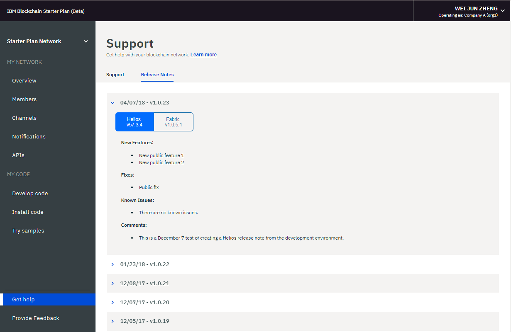
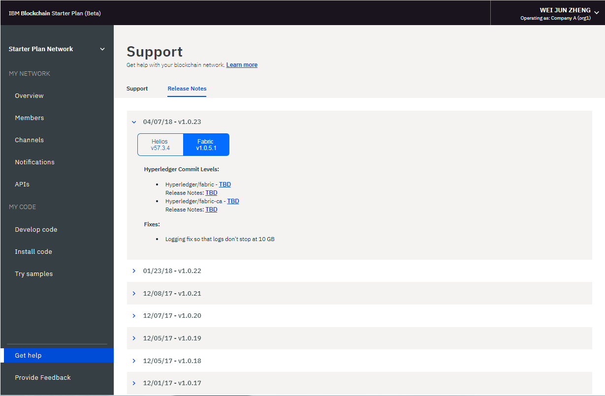
*Figure 12. Release notes*

## Switch organizations
{: #switch-organizations}

If you simulate a multi-organization blockchain network on your own, you can switch to any of the organizations that you own, for example, Organization A. Then you can view and manage Organization A's network resources, such as peers, channels, and chaincodes in the Network Monitor. This feature allows you to create a channel following channel policies and to add peers from multiple organizations to the channel.

Click on the top right corner of the UI (where you should see your name). From the drop-down menu, click on the organization name under **SWITCH ORGANIZATION**. This will be Organization A by default. If you click here, you'll see the other organizations you can switch to. If you click on an organization, your Network Monitor will be automatically refreshed and you can view the network as that organization.

**Figure 13** shows the "Switch organizations" function:

*Figure 13. Switch organizations*

## Reset network
{: #reset-network}

Starter Plan offers the capability to edit your network configuration without deleting and recreating a network. Your network is reset back to the initial network configuration, which includes two organizations, one peer per each organization, and a default channel. This is very useful, for example, when you are running rounds of tests on the blockchain network, which allows you to start over from a relatively clean network.

**Caution**: After you reset the network, the API endpoints of your peers, orderer, and CA are changed. You will need to adjust API endpoint information in your applications.

Click the top right corner and opens the drop-down menu. Click the **Reset Network** button in the menu. If you are ready to reset your network, click **OK** to continue. Your Network Monitor will be refreshed to reflect your new settings.

**Figure 14** shows the "Switch organizations" function:

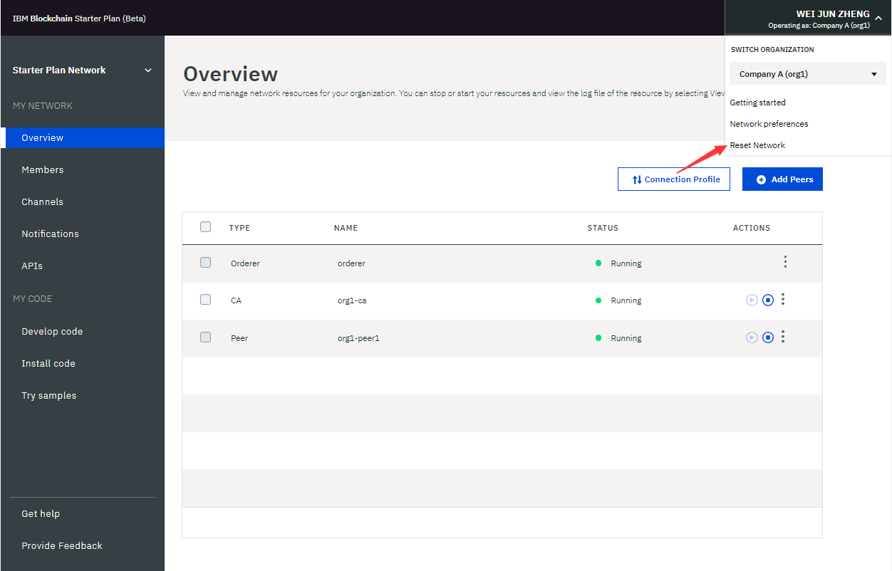
*Figure 14. Reset network*
