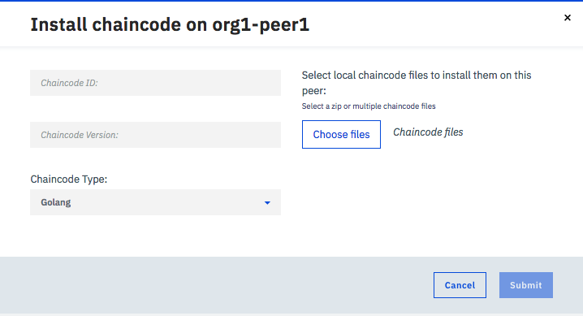

---

copyright:
  years: 2017, 2018
lastupdated: "2018-03-16"
---

{:new_window: target="_blank"}
{:shortdesc: .shortdesc}
{:codeblock: .codeblock}
{:screen: .screen}
{:pre: .pre}

# Installing and instantiating a chaincode

Chaincode is software, which is written in Go or Java, that encapsulates the business logic and transactional instructions
for creating and modifying assets in the ledger.  A chaincode runs in a docker container that is associated with any peer that needs to interact with it.  For more information about developing chaincodes, see [Chaincode Tutorials ](http://hyperledger-fabric.readthedocs.io/en/latest/chaincode.html).
{:shortdesc}

Chaincode is firstly installed on a peer's file system and then instantiated on a channel.  **All channel members need to install the chaincode on every peer that will run this chaincode.**  To use the same chaincode, channel members must give the chaincode the same name and version when they install the chaincode.  Then, the instantiation step involves the initialization of key value pairs and the deployment of the chaincode container.  Any peer, via which applications will interact with a chaincode, must have the chaincode that is installed on the peer's file system and have a running chaincode container.  **However, if a peer uses the same chaincode on multiple channels, it needs only a single instance of the chaincode container**.  

The **installation and instantiation combination** is a powerful feature because it allows for a peer to interact with the same chaincode container across multiple channels.  The only prerequisite is for the actual chaincode source files to be installed on the peer's file system.  As such, if a piece of common chaincode is being used across dozens of channels, a peer would need only a single chaincode container to perform read/writes on all the channel ledgers.  This lightweight approach proves beneficial to computational performance and throughput as networks scale and chaincodes become more elaborate.  

**Note**: If you develop your chaincode in an iteractive way and need to update a chaincode, you need to repeat both installation and instantiation steps for the chaincode.

## Installing a chaincode
{: #installchaincode}

You must install the chaincode on every peer that will run this chaincode.  Complete the following steps to install a chaincode:
1. In the "Chaincode" screen of your Network Monitor, select a peer from the drop-down list to install the chaincode onto.  Click the **Install Chaincode** button.
<!--
    
-->

2. In the **Install Chaincode** pop-up panel, enter the name and version of your chaincode. **Note** that the name and version strings will be used in applications to interact with the installed chaincodes.  Click the **Browse** button and navigate through your local file system to wherever your chaincode source files are stored.  Select one or more chaincode source files to install on the peer.  This example shows a chaincode source file `fabcar.go` with a name of `Chaincode1` and a version of `v001`, which is to be installed onto the `fabric-peer-org2-17439a` peer.  

  

## Instantiate a chaincode
After a chaincode is installed onto the file system of every peer that joins a channel, the chaincode must then be instantiated on the channel so that peers can interact with the ledger via the chaincode container.  The instantiation performs any necessary initialization of the chaincode.  Oftentimes, this will involve setting the key value pairs that comprise a chaincode's initial world state.  

You need to have **Operator** or **Writer** authority on the channel to instantiate the chaincode.  The  chaincode that has the same name and version on different peers needs to be instantiated only once to deploy the chaincode container.  Complete the following steps to instantiate a chaincode:
1. In the "Chaincode" screen of your Network Monitor, select the peer that your installed the chaincode and locate the chaincode that you want to instantiate from the chaincode table.  Then, click the **Instantiate** button under the **Action** header.  
<!--
    
-->

2. In the **Instantaite Chaincode** pop-up panel, set the key value pairs as arguments for chaincode initialization, and select the channel to instantiate on.  Click **Submit**.
<!--
     
-->
