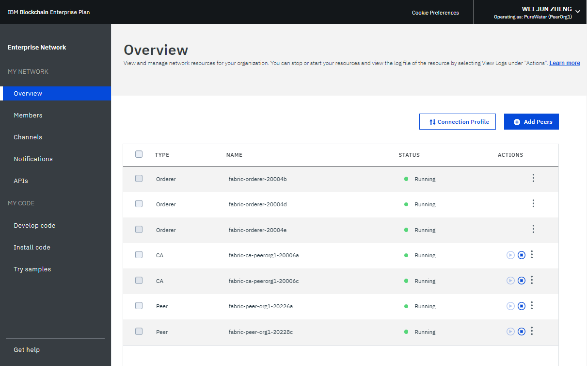
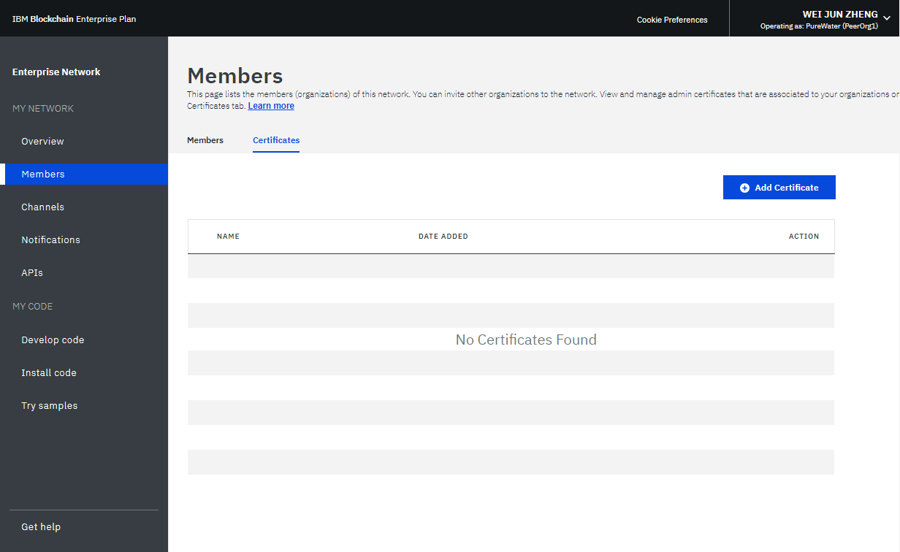
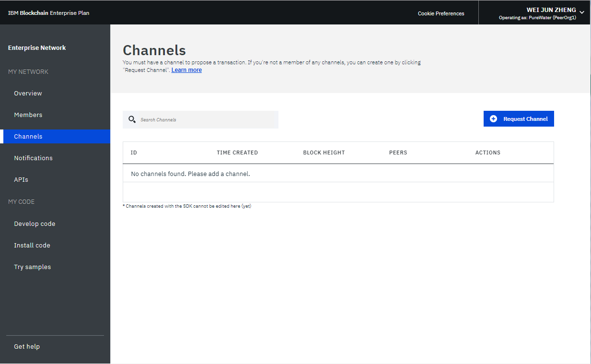
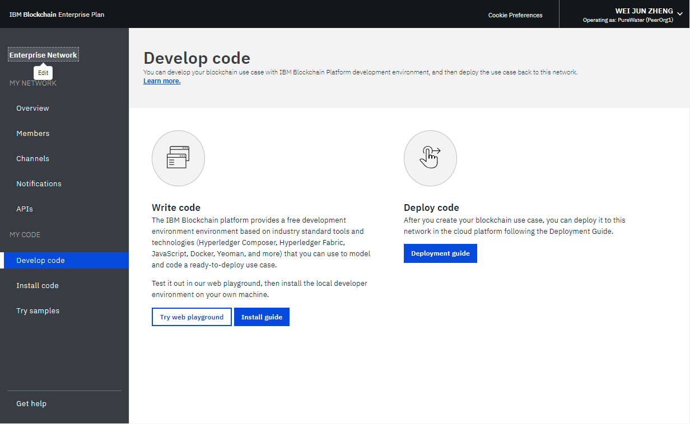
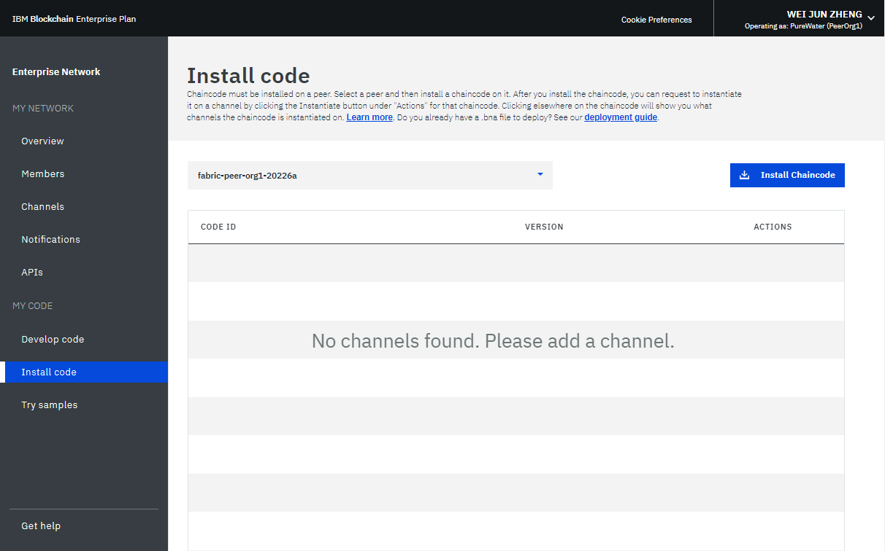
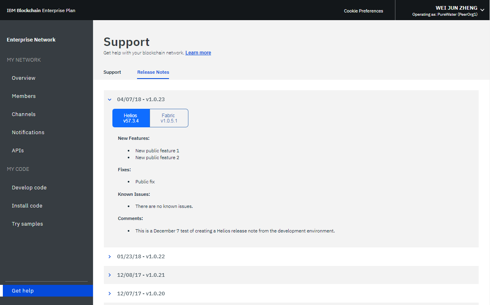
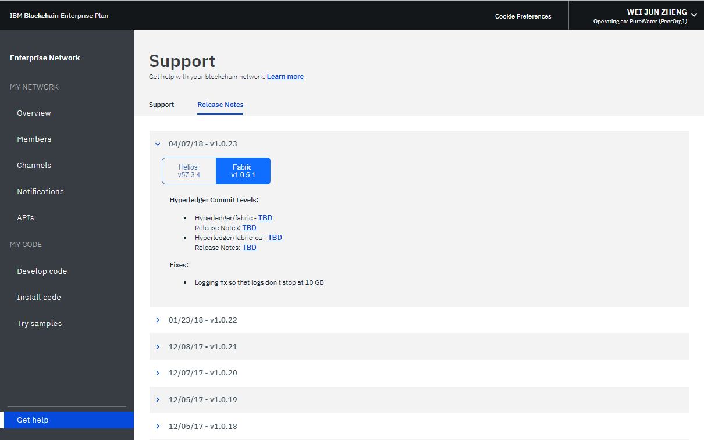

---

copyright:
  years: 2017, 2018
lastupdated: "2018-03-16"

---

{:new_window: target="_blank"}
{:shortdesc: .shortdesc}
{:codeblock: .codeblock}
{:screen: .screen}
{:pre: .pre}

# Operate Enterprise Plan network
{: #v10_dashboard}

{{site.data.keyword.blockchainfull_notm}} Platform brings a Network Monitor to provide an overview of your blockchain environment, including network resources, members, joined channels, transaction performance data, and deployed chaincodes. The Network Monitor also offers you the entry point to run Swagger APIs, develop a network with {{site.data.keyword.blockchainfull_notm}} Platform: Develop, and try sample applications.
{:shortdesc}

The Network Monitor exposes the following screens in three sections. You can navigate to each screen from the left navigator in the Network Monitor.
- The **My network** section contains the "[Overview](#overview)", "[Members](#members)", "[Channels](#channels)", "[Notifications](#notifications)", and "[APIs](#apis)" screens.
- The **My code** section contains the "[Write code](#write_code)", "[Install code](#chaincode)", and "[Try samples](#samples)" screens.
- The "[Get help](#support)" screen shows support information as well as release notes for helios and Hyperledger Fabric (the code base the {{site.data.keyword.blockchainfull_notm}} Platform is based on).

## Overview
{: #overview}

The "Overview" screen displays real-time status information on your blockchain resources including the orderer, CA, and peer nodes. Each resource is displayed under four distinct headers: **Type**, **Name**, **Status**, and **Actions**. During the creation of your blockchain network, three orderer nodes and two CA nodes are automatically created. The CA's are member-specific, whereas the ordering nodes are common endpoints shared across the network.

**Figure 1** shows the "Overview" screen:

*Figure 1. Network overview*

### Node actions
  The **Actions** header of the table provides buttons to start or stop your resources. You can also start or stop a group of nodes by selecting multiple nodes and then clicking the **Start Selected** or **Stop Selected** button. The **Start Selected** or **Stop Selected** button appears on top of the table when you select one or more nodes.

  Note that the Stop and Start actions are not available for an Orderer node. In general, there is no need to stop and start Peer or CA nodes on a network. The Stop and Start actions are provided in case you needed to restart a peer, for example to bring it up in a clean state.

  You can also check component logs by clicking **View Logs** from the dropdown list under the **Actions** header. The logs expose the calls between the various network resources and are useful for debugging and troubleshooting. For example, experiment by stopping a peer and attempting to target it with a transaction, and you will see connectivity errors. When you restart the peer and attempt the transaction again, you will see a successful connection. You can also leave a peer down for an extended period of time as your channels continue to transact. When the peer is brought back up, you will notice a synchronization of the ledger as it receives the blocks that were committed when it was down. When the ledger has been fully synchronized you'll be able to perform normal invokes and queries against it.

### Connection Profile
  You can view the JSON file about low level network information of each resource by clicking the **Connection Profile** button. The connection profile contains all the configuration information that you need for an application. However, because this file only contains the addresses for your specific components and the orderer, if you need to target additional peers, you need to obtain their endpoints. The header containing "url" displays the API endpoint of each component. These endpoints are required in order to target specific network components from a client-side application and their definitions will typically live in a JSON-modeled configuration file that accompanies the app. If you are customizing an application that requires endorsement from peers that are not part of your organization, you'll need to retrieve the IP addresses of those peers from the relevant operators in an out-of-band operation. Clients must be able to connect to any peers from which they need a response.

### Add peers
{: #peers}
Click the **Add Peers** button at the top right to add peer nodes to your network. In Starter Plan, two peers will be added automatically for you at network creation time. In the Enterprise Plan, you can add peer nodes for the first time when you create or join a network or later in the Network Monitor. You might be in different scenarios when you need more peers.  For example, you might want multiple peers to join the same channel for redundancy. Each peers processes the channel's transactions and write to their respective copies of the ledger. In case one of the peers fails, other peers can continue processing transactions and application requests.  You could symmetrically load balance all application requests across the peers, or you could target different peers for different functions. For example, you can use one peer to query the ledger and use another peer to process endorsements for ledger updates.

  In the pop-up "Add Peers" panel, select the number and size of peer nodes you want to add. Currently only "small" peers are available for purchase, however there will eventually be "medium" and "large" to help accommodate larger workloads and higher transaction throughput.

## Members
{: #members}
The "Members" screen contains two tabs to display network member information in the "Members" tab and certificate information in the "Certificates" tab.

### Members
{: #members_tab}
**Figure 2** shows the initial "Members" screen displaying your network members in the "Members" tab:

*Figure 2. Network members*

Besides the members that you invite when you create the network, you can invite other members in the "Members" tab. To invite a member to your network, enter the institution name and operator's email address and click **Add Member**. A network can have a total of 15 members (including the network initiator). To remove a member from your network, click the "remove" symbol at the end of the member row.

### Certificates
**Figure 3** shows the initial "Members" screen displaying member certificates in the "Certificates" tab:

*Figure 3. Certificates*

Operators can manage the certificates for the members in the same institution in the "Certificates" tab. Click **Add Certificate** to open the "Add Certificate" panel. Give a name to your certificate, paste your client-side certificates in PEM format to the "Key" field, and click **Submit**. You need to restart your peers before the client-side certificates can take effect.

For information about generating your cerficate key, see [Generating the client-side certificates](v10_application.html#generating-the-client-side-certificates).

## Channels
{: #channels}

You can segregate your network into channels where each channel represents a subset of members that are authorized to see the data for the chaincodes instantiated on that channel. Every network must have at least one channel for transactions to take place. Each channel has a unique ledger and users must be properly authenticated to perform read/write operations against this ledger. If you're not on a channel, you can't see any data.

**Figure 4** shows the initial dashboard screen displaying an overview of all channels in your network:

*Figure 4. Channels*

Creating a channel will result in the generation of a channel-specific ledger. For more information, see [Creating a channel](howto/create_channel.html).

You can also select an existing channel to view more precise details about the channel, membership, and active chaincodes. For more information, see [Monitoring a network](howto/monitor_network.html).

## Notifications
{: #notifications}

You can handle pending requests and view completed requests in the "Notifications" screen.

**Figure 5** shows the "Notifications" screen:

*Figure 5. Notifications*

When you create a channel or are invited to a new channel, a notification will appear in the Network Monitor.

The requests are grouped into "All", "Pending", and "Completed" subtabs. Numbers after the subtab header indicate the number of requests in each subtab.
   * You can find all your requests in the "All" subtab.
   * Requests that you have not accepted or declined, or you have not viewed, are in the "Pending" subtab. Click the **Review Request** button to view the request, which includes the channel policy and members, and voting status. If you are a channel operator, you can either **Accept** or **Decline** the request, or handle it at another time by clicking **Later**. If the request is accepted by enough channel operators, you can click **Submit Request** to activate the channel update.
   * A submitted request will appear in the "Completed" subtab.  You can click **Review Request** to view its details.

When you have a long list of requests, you can search for a request in the search field on the top.

Pending requests can be deleted by selecting the boxes in the front of them and clicking **Delete Request**. Note that a completed request cannot be deleted.

## APIs
{: #apis}

To facilitate application development, we have exposed our APIs, which you can test against your network using a Swagger UI.

*Figure 6. APIs*

Click the **Swagger UI** link to open the Swagger UI. Note that you need to authorize the Swagger UI with your network credentials (which can be found on this APIs page) before you can run the APIs. For more information, see [Using Swagger APIs](howto/swagger_apis.html).

## Write Code
{: #write-code}

The Enterprise Plan integrates {{site.data.keyword.blockchainfull_notm}} Platform: Develop and provides a development environment with industry standard tools and technologies. You can develop your a network in the environment online or locally. After you develop a network, you can deploy it back to your Enterprise Plan network.

*Figure 7. Write code*

For more information about developing and deploying your code with the Enterprise Plan, see [Developing business networks on Enterprise Plan](develop_enterprise.html).

## Install code
{: #chaincode}

Chaincodes, which are also known as "smart contracts", are pieces of software containing a set of functions to query and update the ledger. They are installed on peers and instantiated on a channel.

*Figure 8. Install code*

A chaincode is first installed on a peer's filesystem and then instantiated on a channel. For more information, see [Installing and instantiating a chaincode](howto/install_instantiate_chaincode.html).

## Try samples
{: #samples}

Sample applications help you to get a better understanding of a blockchain network and application development. Follow the link to the Marbles repo in the Network Monitor for information on how to install the Marbles sample application. For more information on how to develop and deploy your own samples, check out [Developing applications](v10_application.html).

**Figure 9** shows the "Samples" screen:

*Figure 9. Samples*

## Get help
{: #support}

The "Get help" screen contains two tabs to provide support information in the "Support" tab and to describe new and changed functions of each release in the "Release Notes" tab.

**Figure 10** shows the initial "Support" screen displaying support information in the "Support" tab:

*Figure 10. Blockchain support*

Use the links and resources on this page to access troubleshooting and support forums.

* [{{site.data.keyword.blockchainfull_notm}} Service docs](index.html) under **Getting started**, which is this doc site, provides guidances on how to start with {{site.data.keyword.blockchainfull}} Platform on {{site.data.keyword.Bluemix_notm}}. You can find corresponding topics from the left navigator or search any term with the search function on the top.
* [IBM Developer Works ](https://developer.ibm.com/blockchain/) under **Community help** contains resources and information for developers.
* [IBM dWAnswers ](https://developer.ibm.com/answers/smartspace/blockchain/) under **Support ticket** serves as a platform for questions and responses. You can search for responses from previously posed questions or submit a new question. Be sure to include the keyword **blockchain** in your question.
  You can also submit a ticket to {{site.data.keyword.blockchainfull_notm}} support team with the [Open a {{site.data.keyword.Bluemix_notm}} support ticket ]() option.  Share details and code snippets from your specific {{site.data.keyword.Bluemix_notm}} instance.
* [Sample applications ]() under **Blockchain sample applications** provides guidance and sample code snippets to assist in the development of applications.
* [Hyperledger Fabric ](http://hyperledger-fabric.readthedocs.io/) and [Hyperledger Fabric community ](http://jira.hyperledger.org/secure/Dashboard.jspa) under **Hyperledger Fabric** provide more details about the Hyperledger Fabric stack.
  Talk to a [Hyperledger Expert ](https://chat.hyperledger.org/channel/general) with questions about the Hyperledger Fabric code.

If you are unable to debug your issue or ascertain an answer to your question, please submit a support case in the IBM Cloud Service Portal. For more information, see [Getting support](ibmblockchain_support.html).

Figure 11 and 12 show the initial "Get Help" screen displaying new and changed functions of each release in the "Release Notes" tab:

  
*Figures 11. Release notes for Helios*

  
*Figures 12. Release notes for Fabric*
